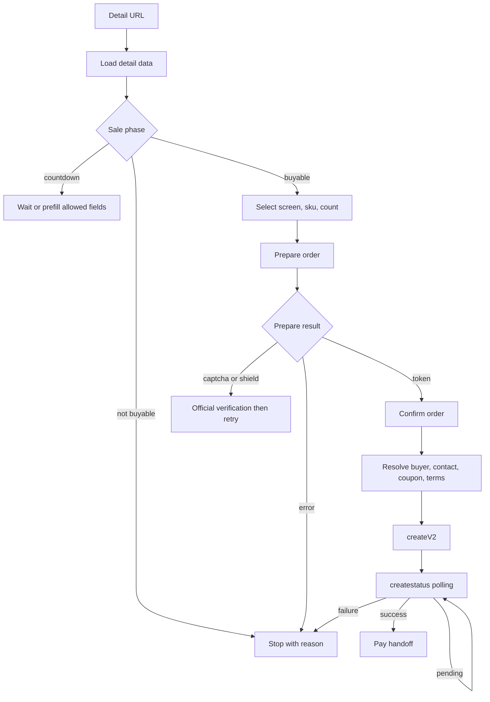

# Bilibili 会员购实名非选座电子票逻辑链路文档

版本：`v0.5-realname-nonseat-eticket`  
日期：2026-05-22  
目标：给后续自动化下单程序提供“实名 + 非选座 + 电子票”票型的逻辑链路、状态机与关键运行态参数来源。  

## 1. 边界

本文只覆盖会员购票务 H5 的实名非选座电子票下单范围：

- 新版详情页 `ticket-renovation/detail`。
- 旧详情页 `mall-dayu/neul-next/ticket/detail`。
- 非选座详情购买层。
- 实名购买人选择。
- 确认订单、创建订单、创建状态轮询、支付交接。

选座票、非实名票和配送纸质票已从本文目标中移除，不作为实现要求或字段矩阵来源。

本文不把支付签名、验证码成功值、热门项目风险 token 写成可复用常量。程序应把它们视为服务端或官方页面运行态数据。

## 2. 推荐执行模式

| 模式 | 用途 | 结论 |
| --- | --- | --- |
| `browser-backed` | 后台真实浏览器执行页面、保留登录态与风控上下文 | 默认 |
| `pure-http` | 对非热门、无验证阻断且已抓全 body/schema 的当前范围直接请求 | 受限 |

`无 UI` 不等于 `不执行前端 JS`。热门项目、验证码、设备上下文和支付交接都更适合用浏览器会话承接。

UA 应作为执行配置固定下来，不在同一订单链路中途切换。当前主链抓包来自 Desktop Edge H5；详情页还可按 Mobile H5 与 BiliApp WebView 建独立 trace，对比来源 query、桥接能力、支付分流与风险 header 后再决定是否共用 payload builder。

## 3. 范围判定

### 3.1 详情入口

先解析购票 URL：

1. `ticket-renovation/detail.html?id={projectId}` 走新版详情接口。
2. `mall-dayu/neul-next/ticket/detail.html?id={projectId}` 走旧详情接口。
3. 分享跳转入口先归一到实际详情 URL。
4. 记录 `from`、`msource`、`from_spmid`、`oaccesskey`、`noTitleBar` 等来源上下文。

### 3.2 必要判定

执行器至少判定：

| 维度 | 值 |
| --- | --- |
| 范围 | `non-seat` 且 `id_bind != 0` |
| 联系人 | 需要联系人 / 不需要 |
| 交付 | 当前目标只接受电子票；配送纸质票判为 out-of-scope |
| 售卖状态 | 未开售倒计时 / 可售 / 暂售罄 / 售罄 / 下线 |
| 风控 | 普通 / `hotProject` / `shield` / captcha |
| 玩法 | 普通 / 拼团 / 众筹 / 联动 / 年卡 / 优惠券 |

### 3.3 执行矩阵

| 分支 | Prepare | Confirm | Create |
| --- | --- | --- | --- |
| 实名非选座 | `project/screen/sku/count/buyer_info rule` | 从 `buyerList` 选购买人 | `buyer_info` 写 JSON 字符串数组 |
| 需要联系人 | 上游不强造 | 读取 `need_contact` | 补 `buyer/tel` 或页面实际字段 |
| 热门/验证 | `collection` 采集行为；`prepare` 可能下发 `ptoken` | 保留 `ptoken/voucher` | 透传 `ctoken/ptoken/voucher` |

联系人和热门分支的控制流已确定。热门字段发送路径已由官方前端包确认；字段矩阵仍要以该分支自己的 `confirmInfo` 与真实提交包为准。

## 4. 主状态机



## 5. 已验证链路

### 5.1 非选座实名票

样例：`project_id=1001300`

```text
detail
  -> 选择场次
  -> 选择票档
  -> 数量确认
  -> order/prepare
  -> confirmInfo
  -> buyer selection
  -> createV2
  -> createstatus
  -> payplatform-h5/cashierdesk
```

确认页真实显示：

- `购买人(1/1)`。
- 购买人与入场人证件一致提示。
- 购票人新增入口。
- 优惠券区域。
- 协议同意区。
- “提交订单成功才会锁票”。

第一次复用旧确认页 token 提交时出现：

```text
当前页面已失效，请返回详情页重新下单
```

程序应重走 `prepare`，不能继续复用过期 token。

当前已抓到的真实请求序列：

```text
POST /api/ticket/order/prepare?project_id=1001300
GET  /api/ticket/order/confirmInfo?token={prepare-token}&timestamp={ms}&project_id=1001300&requestSource=neul-next
POST /api/ticket/stock/check
POST /api/ticket/order/createV2?project_id=1001300
GET  /api/ticket/order/createstatus?token={create-status-token}&project_id=1001300&orderId={order-id}
```

这个样例说明：

- 非选座实名票的 `prepare.buyer_info` 可先是规则字符串，当前抓到 `"2,1"`。
- `confirmInfo` 返回可选购票人、`id_bind`、`need_contact`、金额、票档和 `hotProject`。
- `createV2.buyer_info` 才是选中购票人的 JSON 字符串数组。
- `createstatus` 成功时直接返回 `payParam`，支付签名和二维码 URL 都来自服务端。

## 6. Prepare 构造

### 6.1 非选座

详情购买层前端代码确认普通 `orderObj` 初始字段：

```json
{
  "project_id": "...",
  "screen_id": "...",
  "sku_id": "...",
  "count": "...",
  "pay_money": "...",
  "order_type": 1,
  "timestamp": null,
  "deliver_type": "...",
  "buyer_info": "..."
}
```

前端包装会补：

```json
{
  "newRisk": true,
  "requestSource": "neul-next"
}
```

当前实名非选座样例 `prepare` 实际 body 还带：

```json
{
  "buyer_info": "2,1",
  "token": "",
  "ignoreRequestLimit": true,
  "ticket_agent": ""
}
```

同一登录态重新调用后，当前实名非选座样例的 `prepare` 成功响应已抓到：

```json
{
  "errno": 0,
  "msg": "",
  "data": {
    "token": "{prepare-token}",
    "shield": {
      "open": 0
    },
    "project_name": null,
    "screen_name": null,
    "project_img": null,
    "ga_data": {
      "risk_level": 1,
      "grisk_id": "{prepare-risk-id}",
      "decisions": [],
      "riskParams": null,
      "riskResult": 0,
      "open": null
    },
    "success_seats": null,
    "failed_seats": null,
    "ptoken": null
  },
  "errtag": 0
}
```

## 7. 确认页决策

确认页以 `confirmInfo` 为真值来源，不能只信详情页状态。

确认页执行器应读取：

- 票档、数量、金额。
- `id_bind` / buyer requirement。
- `need_contact`。
- `deliver_type` / 交付边界。
- coupon/year-card/free-pass 状态。
- `hotProject`。
- `orderCreateUrl`。

### 7.1 实名

实名票从账号已维护购票人中选 buyer，`createV2` 的 `buyer_info` 为 JSON 字符串数组。字段至少已见：

```json
[
  {
    "id": 1,
    "name": "...",
    "tel": "...",
    "personal_id": "...",
    "id_type": 0
  }
]
```

### 7.2 联系人与交付边界

- `need_contact` 时补 `buyer` 与 `tel`。
- 当前目标只接受电子票确认页，不写地址字段。
- 若 `confirmInfo` 返回配送纸质票语义或页面进入地址分支，执行器返回 `OUT_OF_SCOPE_DELIVERY`。

## 8. 创建与支付前链路

### 8.1 `createV2`

创建请求至少承接：

- prepare token。
- project/screen/sku/count/pay_money/order_type。
- buyer/contact/coupon 分支字段。
- 风控运行态字段。
- `requestSource=neul-next` 与 `newRisk=true`。

### 8.2 创建轮询

`createV2` 成功先返回创建 token，再轮询 `createstatus`。成功终态将支付参数交给页面 `toPay`。

已验证支付落点：

```text
https://pay.bilibili.com/payplatform-h5/cashierdesk.html
```

支付参数是服务端交接数据；程序只记录与转交，不自行生成签名。

当前实名非选座样例的创建终态已经验证：

- `createV2` 返回 `orderId`、`orderCreateTime`、创建状态轮询 `token`。
- `createstatus` 请求当前实际还带 `orderId`。
- `createstatus.data.payParam` 中已见 `orderExpire`、`payAmount`、`productId`、`returnUrl`、`sign`、`code_url`、`expire_time`。

## 9. 风控参数来源

### 9.1 `collection`, `ctoken`, `ptoken`

热门实名非选座样例证据：

- 已结束项目 `102626` 的旧详情页真实请求为 `GET /api/ticket/project/getV2?id=102626&project_id=102626&requestSource=neul-next`。
- 该真实响应中已见 `data.hotProject = true`。
- 同一响应中已见 `data.id_bind = 2`，说明它属于实名票。
- 同一响应中已见 `data.screen_list[].jump_page = "confirm"`，说明它是非选座确认页链路，而不是选座跳转。

官方页面代码已确认：

1. 详情状态识别 `hotProject` 后初始化 `collection`。
2. 非选座 `prepareCacheOrder` 在热门项目分支把 `collection.encode()` 送入 `prepare.token`。
3. 确认页创建订单时再把 `ctoken=collection.encode()` 放进创建 body。
4. 详情页 `prepare` 成功后，若响应含 `data.ptoken`，会将它追加到确认页 URL：`confirmOrder?...&ptoken={data.ptoken}`。
5. 确认页从 URL query 取回 `ptoken`，创建订单包装层再把它追加到 `createV2` URL query。

### 9.1.1 `collection` / `ctoken` 生成逻辑

当前 bundle 中模块 `66281` 已包含 `Collect` 完整实现，不只是调用点。

初始化逻辑：

1. 热门详情页加载到 `projectInfo.hotProject` 后执行 `Collect.clearCache()`。
2. 删除 `localStorage.ticket_collection_t`。
3. 创建 `new Collect()`，从 `localStorage.ticket_collection` 恢复旧采集数组后继续监听。
4. 确认页识别 `hotProject` 后也创建 `new Collect()`，用于创建单阶段再次编码。

采集状态：

| 变量 | 来源 |
| --- | --- |
| `touchEndCount` | `document.touchend` 次数 |
| `visibleCount` | 页面 `visibilitychange` 回到 `visible` 的次数 |
| `openWindowCount` | 被包装的 `exec("openWindow")` 次数 |
| `intervalSeconds` | `setInterval(1s)` 自增 |
| `prepareElapsedSeconds` | `Date.now() - localStorage.ticket_collection_t` |
| `scrollX`, `scrollY` | 初始化时窗口滚动位置 |
| `innerWidth`, `innerHeight` | 初始化时 viewport 尺寸 |
| `outerWidth`, `outerHeight` | 初始化时窗口外框尺寸 |
| `screenX`, `screenY` | 初始化时窗口位置 |
| `screen.width`, `screen.height`, `screen.availWidth` | 初始化时屏幕尺寸 |

详情页热门 `prepare` 前会把当前时间写入：

```text
localStorage.ticket_collection_t = Date.now()
```

之后确认页 `ctoken` 编码时可得到从 `prepare` 到创建时刻的 `prepareElapsedSeconds`。

`encode()` 当前布局为固定 16 字节缓冲区：

| Byte offset | 内容 | 宽度 |
| --- | --- | --- |
| `0` | `touchEndCount` | uint8 |
| `1` | `scrollX` | uint8 |
| `2` | `visibleCount` | uint8 |
| `3` | `scrollY` | uint8 |
| `4` | `innerWidth` | uint8 |
| `5` | `openWindowCount` | uint8 |
| `6` | `innerHeight` | uint8 |
| `7` | `outerWidth` | uint8 |
| `8..9` | `intervalSeconds` | uint16 |
| `10..11` | `prepareElapsedSeconds` | uint16 |
| `12` | `outerHeight` | uint8 |
| `13` | `screenX` | uint8 |
| `14` | `screenY` | uint8 |
| `15` | `screen.width` | uint8 |

写入规则：

- `uint8` 字段超过 `255` 截断到 `255`。
- `uint16` 字段超过 `65535` 截断到 `65535`。
- 空洞字节使用 `screen.height` 或 `screen.availWidth` 的低字节回填；当前 16 字节布局实际已被上述字段占满。
- DataView 默认按 big-endian 写 `uint16`。

编码步骤：

1. 将采集状态写入 16 字节 `ArrayBuffer`。
2. 将每个字节转成单字符字符串。
3. 对字符码再写入 `Uint16Array`。
4. 取该 `Uint16Array` 的底层字节并 `btoa`。
5. 返回值即 `prepare.token` 或 `createV2.ctoken`。

因此 `ctoken` 是前端可复现的行为采集编码值，不是服务端签名；但它依赖当次页面行为和窗口环境，不能把旧值当常量复用。

当前工作区已落一份按该 bundle 复刻的生成器：

- `bilibili-ctoken-generator.js`

生成器接入方式：

```js
const { CollectTokenGenerator } = require("./bilibili-ctoken-generator");

// 详情页热门分支
const detailCollect = new CollectTokenGenerator({
  windowLike: window,
  documentLike: document,
  storage: window.localStorage,
}).attach();
detailCollect.markPrepareStart();
const prepareToken = detailCollect.encode(); // -> prepare body.token

// 确认页热门分支会重新创建 Collect，并从 ticket_collection 继续状态
const confirmCollect = new CollectTokenGenerator({
  windowLike: window,
  documentLike: document,
  storage: window.localStorage,
}).attach();
const createCtoken = confirmCollect.encode(); // -> createV2 body.ctoken
```

若自动化程序不运行真实页面，可用 `encodeCollectToken(state)` 直接编码采集快照；快照字段必须按上表准备，且命中 `ticket_collection` 缓存时应沿用缓存中的窗口/屏幕快照。

使用关系要区分字段名：

| 阶段 | 请求字段 | 是否使用 Collect 编码 | 值是否通常相同 |
| --- | --- | --- | --- |
| 热门 `prepare` | `body.token` | 是 | 不适用 |
| 热门 `createV2` | `body.ctoken` | 是 | 通常不同 |

两次值可能不同的原因：

1. `prepare` 前后的 `intervalSeconds` 不同。
2. 创建单编码会带 `prepareElapsedSeconds`。
3. 确认页会再次 `new Collect()` 并从 `ticket_collection` 恢复/继续状态。
4. 跳转、可见性、触摸等计数可能在两阶段之间变化。

### 9.1.2 `ptoken` 生成边界

当前前端代码没有生成 `ptoken` 的算法。已确认的链路是：

```text
prepare response data.ptoken
  -> confirmOrder URL query ptoken
  -> confirmInfo query ptoken
  -> createV2 URL query ptoken
```

普通样例 `1001300` 的真实 `prepare` 响应中 `data.ptoken = null`。热门项目是否下发非空 `ptoken`，仍需可提交热门项目真实包验证。

自动化构造策略：

- 默认让官方页面在已登录浏览器会话中生成这些字段。
- 记录即将发送的请求，透传页面生成值。
- 不复用过期 `ctoken`、`ptoken`、`voucher`。
- `ctoken` 可按当前 `Collect` 实现生成，但默认仍优先复用官方页面实例，避免遗漏运行时采集状态。
- `ptoken` 按 `prepare` 响应透传，不自行造值。

当前证据能够确认热门项目的字段来源和发送位置；由于 `102626` 已结束，无法从该项目按钮直接补到热门订单提交时的实时 token 值。

### 9.2 验证与 voucher

已见分支：

- `data.shield.open`。
- `errno=100044`。
- `graph/prepare`、`graph/check`。

验证成功后使用当次 `voucher` 重试原请求；取消验证则输出 blocker。

### 9.3 点击与设备上下文

已见字段：

- `clickPosition = {x, y, origin, now}`。
- `deviceId`。
- `deviceFingerprint`。
- `ticket_agent`。

浏览器模式自然生成；纯 HTTP 模式应把缺失上下文写入 trace，而不是假装覆盖热门项目。

## 10. 自动化实现建议

模块切分：

| 模块 | 责任 |
| --- | --- |
| `DetailResolver` | 详情 URL 归一、详情数据、售卖状态 |
| `ScopeGuard` | 拒绝选座、非实名与配送纸质票输入 |
| `TicketClassifier` | 联系人/交付/风险判型 |
| `PrepareClient` | prepare payload 与 token 生命周期 |
| `ConfirmResolver` | confirmInfo 解析 |
| `BuyerResolver` | buyer/contact |
| `CreateOrderClient` | createV2 + retry policy |
| `CreateStatusPoller` | createstatus |
| `PayHandoff` | 支付参数透传 |
| `TraceRecorder` | HAR、字段脱敏、状态机日志 |

重试策略：

- `prepare` 失败先看 token 时效、库存、验证码。
- `createV2` 不做无界高频重试。
- 遇到未支付重复单先识别订单状态。
- 支付不自动代付。

## 11. 证据审计

| 结论 | 证据 |
| --- | --- |
| 实名非选座普通样例可走到支付前 | `1001300` authenticated `prepare -> confirmInfo -> createV2 -> createstatus` 抓包 |
| `prepare` 成功响应 schema | `1001300` 登录态 `order/prepare` 成功响应已补抓 |
| `prepare.buyer_info` 在当前样例是规则字符串 | `1001300` `order/prepare` request body |
| `createV2.buyer_info` 在当前样例是购买人 JSON 字符串数组 | `1001300` `createV2` request body |
| `createstatus` 成功后返回服务端支付参数 | `1001300` `createstatus` response |
| 热门标志在已结束实名非选座项目可见 | `102626` `project/getV2` response 中 `data.hotProject=true`, `data.id_bind=2`, `screen_list[].jump_page="confirm"` |
| 新补已结束项目仍属电子票 | `102194` 与 `100596` `project/getV2` 均见 `has_eticket=true`, `has_paper_ticket=false`, `screen_list[].delivery_type=1` |
| 热门 prepare/create 风险字段发送位置 | 官方详情与确认页前端包：`prepareCacheOrder`, `createOrder`, `createV2` wrapper |
| `ctoken` 生成逻辑已追到编码实现 | 官方前端包模块 `66281` 中 `Collect`：采集行为/窗口状态，编码为固定 16 字节 token |
| `ptoken` 当前来源已纠正 | 详情页把 `prepare.data.ptoken` 追加到确认页 URL，确认页再透传到 `createV2` URL |
本文没有把未抓到的热门实时 token、验证码成功包写成“已完整获得”。

## 12. 尚需 HAR 补齐

当前仍应保留补抓项：

- 热门项目真实下单时的 `prepare/createV2` 请求样例；字段来源与发送位置已由旧热门详情响应和官方代码确认。
- Desktop/Mobile/BiliApp UA 对照。
